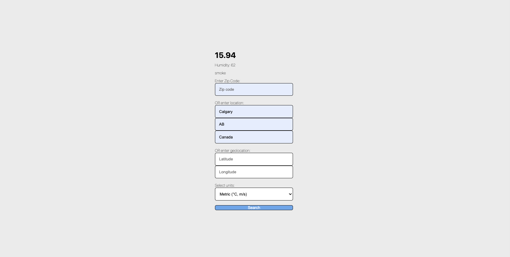

# Weather API lab

## Description

The Weather App is a simple web application that allows users to check the weather for a specific location by entering a ZIP code, city name, state, country, or geolocation coordinates. Users can also choose between metric (°C, m/s) and imperial (°F, mph) units for temperature and wind speed.

## Features

- Retrieve weather information using ZIP code, city name, state, country, or geolocation.
- Select units (metric or imperial) for temperature and wind speed.
- Display temperature, humidity, and weather description.
- Handle errors in case of API request failures.

## Screenshot



## Usage

1. Clone this repository to your local machine:

   ```
   git clone https://github.com/laurelmclean/ACS-3310-weather-api-lab.git
   ```

2. Open the `index.html` file in a web browser to access the Weather App.

3. Enter the location details (ZIP code, city, state, country, or geolocation coordinates) and select the desired units from the dropdown.

4. Click the "Search" button to retrieve and display the weather information.

## Dependencies

- This project uses the [OpenWeatherMap API](https://openweathermap.org/) to fetch weather data. You'll need to sign up for a free API key from OpenWeatherMap and replace it in the JavaScript code where indicated.

